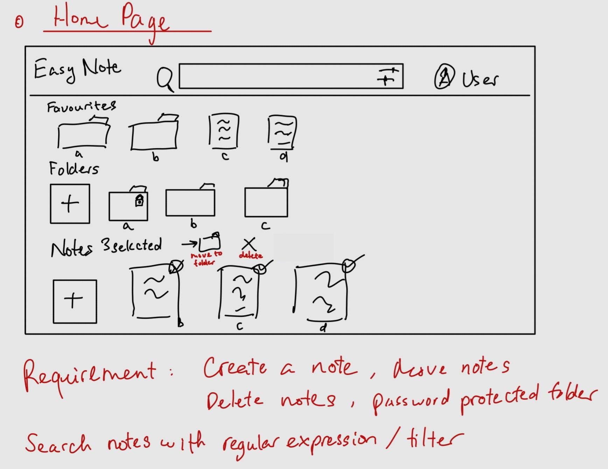
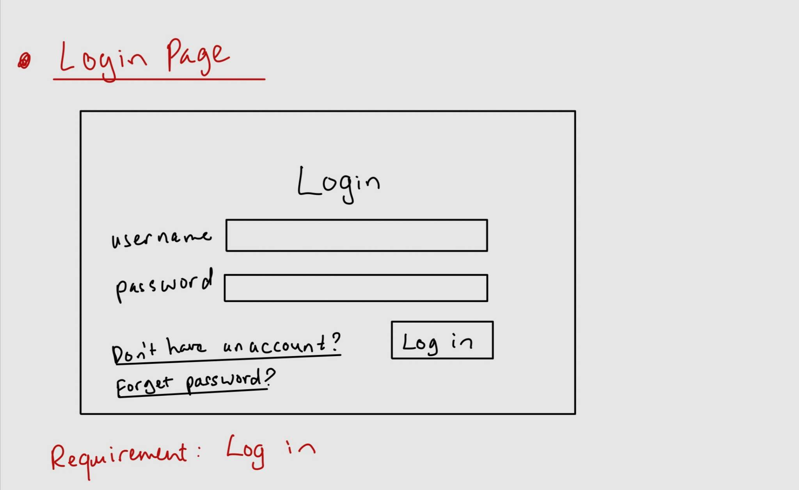
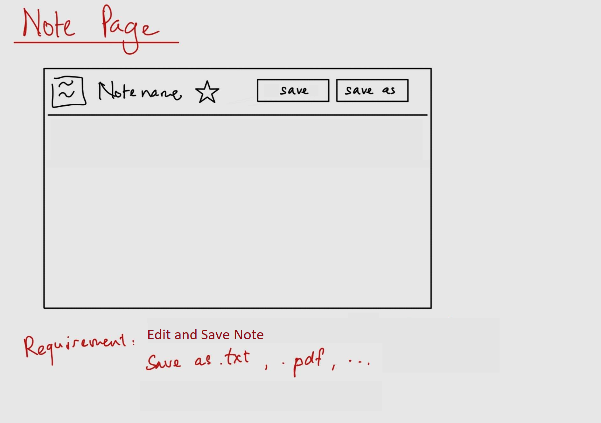
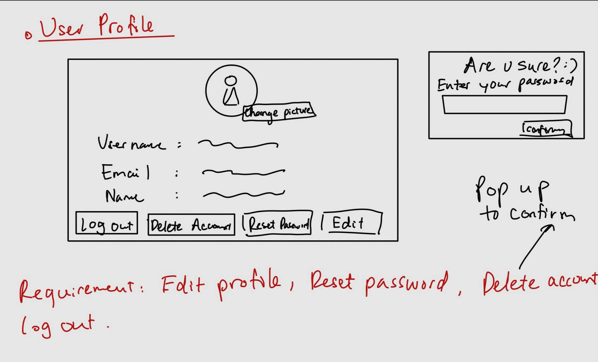
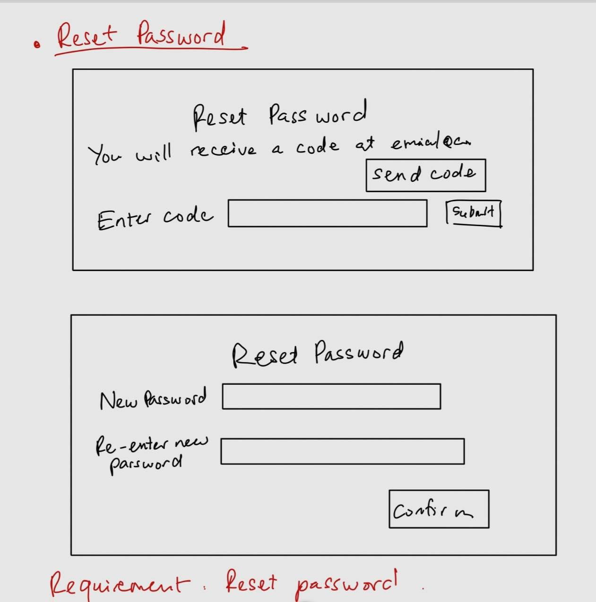
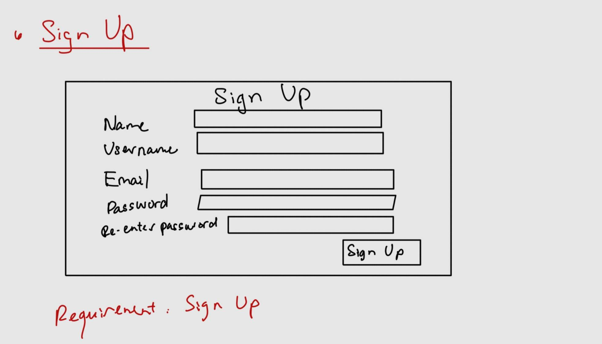

## Functional Requirements
1. Sign Up (Thy)
2. Edit User Profile (Anthony)
3. Delete Account (Charles)
4. Login (CJ)
5. Logout (CJ)
6. Reset password(Charles)
7. Edit and Save Note(Anthony)
8. Create a Note / Folder(Anthony)
9. Move notes into different categories/folders (Anthony)
10. Accessing a password protected folder (Charles)
11. Advance search items with regular expressions or filters by categories (Thy)
12. Opening Notes and Folders (Charles)
13. Save notes as, pdf, etc (Thy)
14. Delete notes  (CJ)

Homepage

Login

Note Page

Profile

Reset Password

Sign Up

 

## Non-functional Requirements
1. Multilingual support
2. Only expected to work on Google Chrome

## Use Cases 
### 1. Sign Up (Thy)
- **Pre-condition:** The user is on the webpage
- **Trigger:** The user hit the sign up button
- **Primary Sequence:**
1. The system prompts the user to enter email address, username, password, and re-enter their password.
2. The user enters the email address, username, password, and validating password.
3. The system checks if the user entered the prompts correctly and sends a validation email.
4. The user checks their email for a validation code and enters the code.
5. The system validates the code and stores the account information on the database.
6. The system takes the user to the profile customization page. 
7. The system prompts the user to upload a profile picture, and enter their biography.
8. The user uploads their profile picture, enters their biography and then clicks the save button.
9. The system saves the profile to the database 
10. The system take the user to their homepage
- **Primary Postconditions:**
1. The user account is created and stored in the database
2. The user can log in this account anytime after the account is created
- **Alternate Sequence:**
2. The user enter an invalid email address, missing any field or the passwords don’t match
- a. Display an error message
- b. Prompt the user to enter the information again
4. The user enter an incorrect validation code
- a. Display an error message
- b. Prompt the user to enter the information again 
	8. The user didn’t upload a profile picture or/ and enter their biography.
- a. The system uses the default profile picture and leaves the biography blank. The system save the profile to the database

 

### 2. Edit User Profile (Anthony)
- **Pre-condition:** The user is logged in.
- **Trigger:** The user clicks the “edit profile” button in the profile page.
- **Primary Sequence:**
1. The user makes changes to their biography.
2. The user clicks the “Save Changes” button.
3. The system prompts the user with an “Are you sure?” message.
4. The user clicks confirm. 
- **Primary Postconditions:**
- The user’s profile is updated. 
- **Alternate Sequence:**
1. The user does not make any changes to their profile and clicks “Save Changes”.
- a.The System displays a “No changes were made” message.
2. The user clicks no on the prompt.
- a.The System displays a “No changes were made” message.

 

### 3. Delete User Profile (Charles)
- **Pre-condition:** The user has a profile and is logged in.
- **Trigger:** The user clicks the “delete profile” button in the profile page.
- **Primary Sequence:**
1. The user opens the profile page and clicks the “delete profile” button.
2. The system prompts the user with an “Are you sure?” prompt with two buttons, “Delete” or “Cancel”.
3. The user clicks the “Delete” button.
4. The system will ask the user for their password for verification.
- **Primary Postconditions:**
- The system will delete the record of the user’s profile that is saved on the database if the “Delete” button is pressed and the user is verified.
- **Alternate Sequence:**
1. The user clicks the “Cancel” button and the profile record is not deleted.
2. The password is not verified so the profile record is not deleted. 

 

### 4. Login (CJ)
- **Pre-condition:** User must have previously registered an account within the system or application.
- **Trigger:** User's attempt to access the application or system that requires authentication
- **Primary Sequence:** 
1. The user launches the program or system and goes to the login screen.
2. The user enters their login or email address, as well as the related password, into the appropriate boxes.
3. The system compares the entered username/email to the user records in the system's database.
4. The system compares the supplied password to the stored password for the provided username/email.
5. If the credentials entered match the stored information, the system provides the user access.
6. After successful authentication, the user is granted access to the application's features or services based on their authorization level.
- **Primary Postconditions:** 
- The user is logged into the application upon successful authentication.
- The system logs the user's session and activities for security and auditing purposes.
- The user retains access until they log out or the session expires due to inactivity.
- **Alternate Sequence:** 
3. If the entered username/email does not exist or the password is incorrect, the system prompts the user with an error message.
- a. The user may be given the option to reset the password or try logging in again.

 

### 5. Logout (CJ)
- **Pre-condition:** Users must be logged into the application.
- **Trigger:** The user actively selects the "logout" or "sign out" option within the application.
- **Primary Sequence:** 
1. The system displays a confirmation message to verify the user's intent to log out.
2. The user clicks confirm.
3. The system invalidates the user's current session, removing the session token or related authentication information.
4. After logout, the system redirects the user to the login page.
- **Primary Postconditions:** 
- The user is logged out of the system.
- The user is directed to the login page.

 

### 6. Reset Password (Charles)
- **Pre-condition:** User must have an account.
- **Trigger:** The user clicks on the “Reset password” on the login or profile page.
- **Primary Sequence:**
1. The system will automatically send a verification code to the user’s logged email address.
2. A new window will open prompting the user to enter the code.
- a. The user will have the option to resend the code by the “Resend code” button.
3. System will remove the logged password on the database.
4. Once the user types the code a new window will open prompting the user to type a new password and repeat the process.
5. The new password will be logged onto the database.
- **Primary Postconditions:**
- The user’s password is changed.
- **Alternate Sequence:**
1. User enters the wrong code for verification.
- a. User is prompted to enter a code that is re-sent.
- b. If the user still types in the wrong code, the system will lock the account.

 

### 7. Edit and Save Note(Anthony)
- **Pre-condition:** The user is on one of their note pages.
- **Trigger:** The user edits the text on the current note. 
- **Primary Sequence:**
1. The user clicks save.
2. The system updates the user's note.
- **Primary Postconditions:**
-  Any changes made to the contents of the note are saved.
- **Alternate Sequence:**
1. The user makes changes to their note, but does not save.
- a. The changes are not saved to the note.

 

### 8. Create a Note / Folder (Anthony)
- **Pre-condition:** The user is on their homepage.
- **Trigger:** The user clicks the new Note/Folder button.
- **Primary Sequence:**
1. The system prompts the user to enter a name.
2. The user enters a name and clicks the create button.
3. The system creates a new Note/Folder and displays it on the homepage.
- **Primary Postconditions:**
-  A new Note/Folder is created with the name the user specified and is available to the user on the homepage. 
- **Alternate Sequence:**
3. The user does not enter a name and clicks the create button.
- a. The Note/Folder is still created, but has the name "untitled".
1. If the user clicks on the icon for a password protected folder they will be prompted to enter a password along with a name.

 

### 9. Ability to move notes into different folder (Anthony)
- **Pre-condition:** The user is on their homepage.
- **Trigger:** The user clicks on one or many of their notes and selects the “Move to folder” button.
- **Primary Sequence:**
1. The system prompts the user to select which folder they want to move the note(s) to.
2. The user selects the folder.
3. The user clicks the “move” button.
4. The system moves the note(s) to the corresponding folder.
- **Primary Postconditions:**
- The folder is in the correct location and the user is brought to the default homepage.
- **Alternate Sequence:**
1. The user clicks the exit button at any point in the process.
- a. The user is brought back to the homepage.

 

### 10. Accessing a password protected folder (Charles)
- **Pre-condition:** The user needs to be logged in and verified.
- **Trigger:** The user clicks on the password protected folder button/icon.
- **Primary Sequence:**
1. The system prompts the user to enter a password for the folder.
2. System verifies this password through the database.
- **Primary Postconditions:**
- Users would be able to edit, add, or delete notes located in the folder after the database verifies the password.
- **Alternate Sequence:**
1. The user logs in but does not make any changes inside the password protected folder.
- a. The user can exit out of the folder.
- b. The system exits out of the folder after no user activity is detected.

 

### 11. Advance search items with regular expressions or filters by categories (Thy)
- **Pre-condition:** The user is logged into their account
- **Trigger:** The user enters an expression into the search bar or clicks on the filter icon next to the search bar.
- **Primary Sequence:**
1. The system displays a drop down menu if the user clicks on the filter icon.
2. The system redirects the user to the result page after the user customize their filter or press enter after they have entered some expressions in the search bar.
- **Primary Postconditions:**
1. The result page contains notes or folders that fit the user’s search criteria
- **Alternative Sequence:**
3. The user did not enter anything to the search bar or customize their filter.
- a. The system will not redirect the user to the result page

 

### 12. Opening notes and folders (Charles)
- **Pre-condition:** The user is on the homepage and is logged in.
- **Trigger:** The user double clicks on the specified note or folder icon that they want to edit.
- **Primary Sequence:**
1. The system will retrieve the specified file.
2. The system will display that file’s information to the user.
- a. If it is a note file it will display the text stored
- b. If it is a folder file it will display files that are stored in that folder.
- **Primary Postconditions:**
1. The user is on the note or folder that they wanted to open.

   

### 13. Save notes as txt, docx or pdf (Thy)
- **Pre-condition:** The user is open the note they want to save
- **Trigger:** The user click the “save as” button
- **Primary Sequence:**
1. The system displays a drop down menu which the user can choose between txt, docx or pdf.
2. The user chooses which type of file they want to save the note as.
3. The system converts the note to the type the user chose and is downloaded onto the user’s computer.
-**Primary Postconditions:** 
1. The note is converted and downloaded to the user’s computer.

 

### 14. Delete Notes (CJ)
- **Pre-condition:** The user must be logged into the note-taking application. The user also must have created or have access to the notes they intend to delete.
- **Trigger:** The user's explicit action or request to remove one or multiple notes from the note-taking application.
- **Primary Sequence:** 
1. The user navigates to their note on the homescreen of the application.
2. The user selects one or multiple notes they wish to delete by clicking on them once.
3. The user clicks on the "Delete" button to remove the selected notes.
4. The system confirms the user's intent to delete the selected notes.
5. The system permanently erases the selected notes from the database.
- **Primary Postconditions:** 
- The selected notes are permanently deleted from the application.
- The system updates the note list to reflect the removed notes.
- Confirmation of successful deletion is provided to the user.
- **Alternate Sequence:** 
4. If the user chooses to cancel the deletion action, the system returns the user to the notes list without removing the selected notes.

